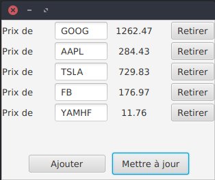

# Stock Ticker

**Technologies used**
- Spring Boot (framework)
- JavaFX (UI)
- JavaFX-Weaver (Spring-FX bridge)
- JUnit 5
- Travis CI

**Other**
- REST API ([finnhub.io](https://finnhub.io/))
- MockRestServiceServer
- Asynchronous UI updates

Demo application using Spring and a REST service to track stock prices.

**TODO**
- CI: package jar and release on RELEASE tag.
